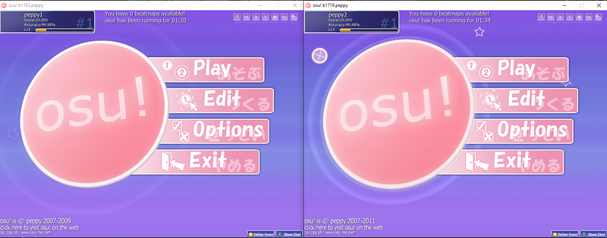
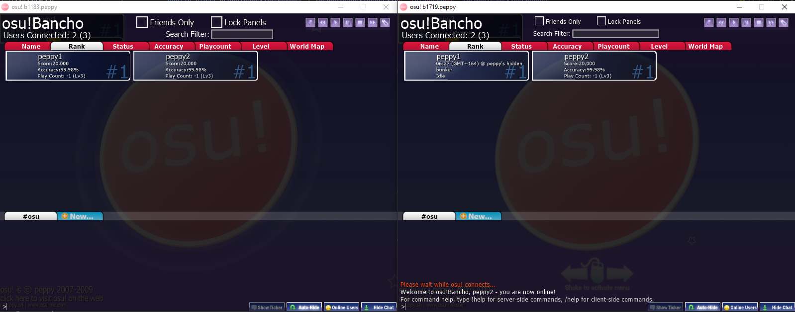

# espcho
Experimental osu! server for 2010 clients, running on ESP32. It's designed for the b1596 version of the game, but additionally other versions between b695 and b1719 are working to some extent.

## Status
This server is very experimental, it will probably never be production ready (why would you run a production server on a microcontroller anyways?)

## osu!Direct
This implementation implements osu!Direct by forwarding requests to Mino (catboy.best).

There are a few caveats though, like response from Mino not matching what b1596 expects, but simple searches do work.

Due to forced HTTPS on catboy.best domain and ESP32 not having up-to-date root certificates, you have to disable TLS certificates at your own risk by enabling `CONFIG_ESP_TLS_INSECURE` and `CONFIG_ESP_TLS_SKIP_SERVER_CERT_VERIFY` in your board's menuconfig.

## Screenshots

## Useful resources
These projects were extremely helpful when making espcho!
 - [Lekuruu/chio.py](https://github.com/Lekuruu/chio.py) - in-depth implementation of every Bancho packet for every osu! version
 - [Lekuruu/bancho-documentation](https://github.com/Lekuruu/bancho-documentation/wiki) - some technical information about the Bancho protocol
 - [osuTitanic/deck](https://github.com/osuTitanic/deck) - implementation of client API (`/web/` endpoints) for every osu! version
