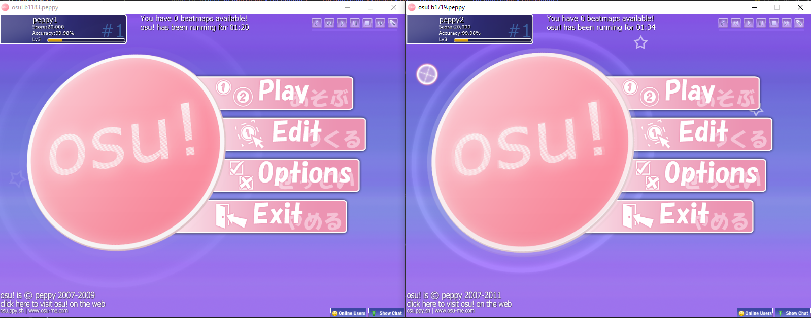
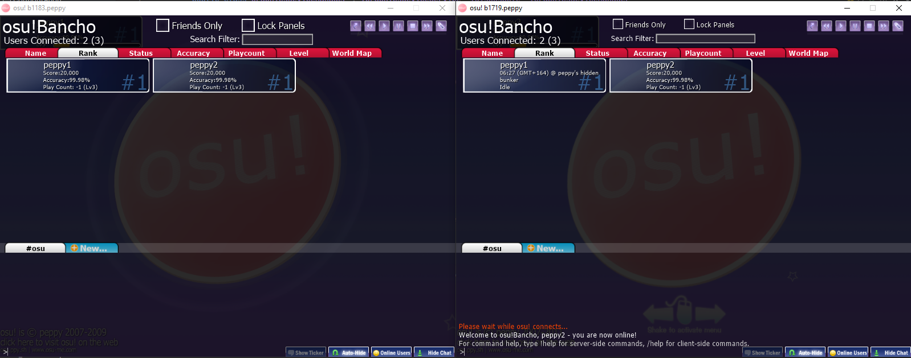

# espcho
Experimental osu! server for 2010 clients, running on ESP32. It's designed for the b1596 version of the game, but additionally other versions between b535 and b1719 are working to some extent.

## Status
This server is very experimental, it will probably never be production ready (why would you run a production server on a microcontroller anyways?)

## Connecting
Unfortunately old osu! clients don't have an equivalent to `-devserver`, and doing just DNS tricks won't work because the Bancho IP address is hardcoded.

However, you can connect to the server using [Titanic! Hook](https://github.com/osuTitanic/hook) which will properly patch the Bancho IP without modifying the client.

You have to add records to hosts file (or add these at your self-hosted DNS server) with `osu` and `server` subdomains pointing at your ESP32's IP, for example for domain `espcho.local` you would add `osu.espcho.local` and `server.espcho.local`.

Next, you'll follow the [Titanic! Hook instructions](https://osu.titanic.sh/wiki/en/Patcher). Launch the client using the Titanic! Hook executable at least once. Then open `Titanic!.cfg` in a text editor and edit `ServerName` option to point at your ESP32's local domain (`espcho.local` in this case). Once you start the game using `Titanic.exe`, the client should be connected to espcho. Note that Titanic! Hook does not tamper with your osu! executable, so you have to start it using the Titanic! Hook executable to connect to espcho.

## osu!Direct
This implementation implements osu!Direct by forwarding requests to Mino (catboy.best).

There are a few caveats though, like response from Mino not matching what b1596 expects, but simple searches do work.

Due to forced HTTPS on catboy.best domain and ESP32 not having up-to-date root certificates, you have to disable TLS certificates at your own risk by enabling `CONFIG_ESP_TLS_INSECURE` and `CONFIG_ESP_TLS_SKIP_SERVER_CERT_VERIFY` in your board's menuconfig.

## Screenshots

## Useful resources
These projects were extremely helpful when making espcho!
 - [Lekuruu/chio.py](https://github.com/Lekuruu/chio.py) - in-depth implementation of every Bancho packet for every osu! version
 - [Lekuruu/bancho-documentation](https://github.com/Lekuruu/bancho-documentation/wiki) - some technical information about the Bancho protocol
 - [osuTitanic/deck](https://github.com/osuTitanic/deck) - implementation of client API (`/web/` endpoints) for every osu! version
